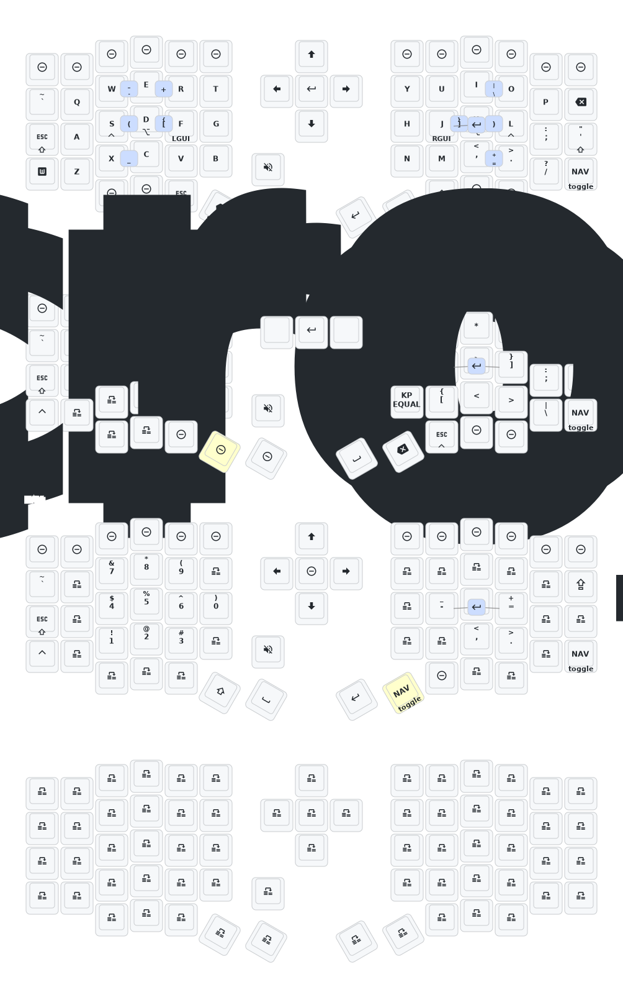

## My ~~Sofle~~ corne layout

The reason why I call my Sofle a corne is because I got myself a Sofle and turned it into a 42-keys keyboard by removing all the hard to reach keys - whole top row as well as 2 keys on either side of the thumb cluster.

So, it really is a 42 keys corne in disguise.

Main uses:
- Programming
- As mouseless as it can be
- A lot of **vim** and **tmux**
- Using mainly on MacOS and ocassionally on Linux
- Using HYPER (All 4 modifiers pressed at once: GUI + Shift + Alt + Ctrl)
- Using all sorts of macros:
    - one-key pairs (i.e. `()`, `[]`, `{}`) with caret autopositioning inside the pair
    - one-key quotes/apostrophes (again, with the caret placed inside)
    - one-key most used tmux combos
    - [homerow.app](https://www.homerow.app/) combos (scrolling, hotkeys overlay)
- Bluetooth tap dance (one tap = connect to profile, 2 taps = disconnect)
- caps word for defining constants

