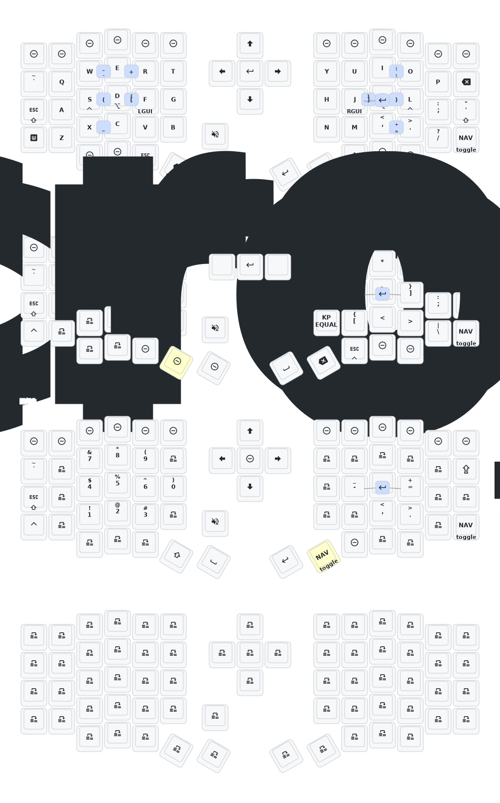

Sofle config designed for vim and tmux.

At this stage it's more of a Corne rather than Sofle because the first row as well as 2 keys per thumb cluster are disabled completely, they. I deemed those to be too hard to reach.

